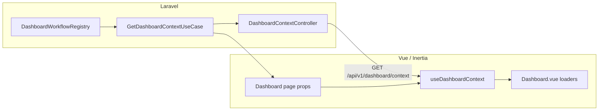

# Dashboard workflow context (2026)

**Last updated:** May 30, 2026  
**Status:** Implemented (Phase 4 — all workflow surfaces extracted; Dashboard.vue is a thin shell)

---

## Purpose

The home dashboard is a **workflow launcher**, not a 1:1 map of RBAC role codes. Each session receives one or more **workflow stripes** (Front Desk, Clinician, Operations, etc.) derived from **effective permissions** and **role codes** (for auto-landing priority only).

Authoritative eligibility rules live in PHP so the SPA does not duplicate hospital role matrices.

---

## Architecture



| Layer | Responsibility |
|--------|----------------|
| `DashboardWorkflowRegistry` | Workflow catalog, eligibility, priority order, default workflow key |
| `GET /api/v1/dashboard/context` | JSON for refresh / API clients |
| Inertia `dashboardContext` prop | First-paint context on `/dashboard` |
| `resources/js/config/dashboardPresets.ts` | Client fallback if context missing (offline/tests) |
| `resources/js/workflows/buildWorkflowSurface.ts` | Dispatches to per-workflow surface builders |
| `resources/js/workflows/operations/surface.ts` | Operations KPIs, queue, handoff, watch items |
| `resources/js/workflows/records/surface.ts` | Medical records workflow surface |
| `resources/js/workflows/supply/surface.ts` | Supply chain workflow surface |
| `Dashboard.vue` | Shell: data loading, tabs, search, delegates all workflow UI to surface modules |

---

## API contract

**Endpoint:** `GET /api/v1/dashboard/context`  
**Auth:** Session (same middleware stack as other `v1` routes)

**Response `data`:**

| Field | Type | Description |
|--------|------|-------------|
| `schemaVersion` | string | `dashboard-context.v2` |
| `defaultWorkflowKey` | string | Auto-landing workflow when user selects “Auto” |
| `eligibleWorkflowKeys` | string[] | Ordered by priority (highest first); filtered by facility subscription entitlements when configured |
| `workflows` | object[] | `key`, `label`, `description`, `modules[]`, `widgets[]` (`id`, `label`, `permission`) for eligible workflows only |
| `canSwitchWorkflow` | boolean | Show workflow switcher when true |
| `session.roleCodes` | string[] | Uppercase active role codes |
| `session.permissionCount` | number | Effective permission count |

---

## Workflow keys (Phase 1)

| Key | Label | Typical audience |
|-----|--------|------------------|
| `admin` | Admin | Facility/platform administrators |
| `emergency` | Emergency | ED / triage |
| `operations` | Operations | Staff admin, credentialing, privileging |
| `cashier` | Cashier | Billing / claims |
| `clinician` | Clinician | OPD / clinical documentation |
| `records` | Medical Records | HIM / MR officer |
| `nursing` | Nursing | Ward / bedside |
| `theatre` | Theatre | Perioperative |
| `direct_service` | Direct Service | Lab / pharmacy / radiology |
| `supply` | Supply Chain | Storekeeper / procurement |
| `front_desk` | Front Desk | Registration / scheduling |

**Auto-landing priority** (first eligible wins):  
`admin` → `emergency` → `operations` → `cashier` → `clinician` → `records` → `nursing` → `theatre` → `direct_service` → `supply` → `front_desk`

---

## Eligibility rules (summary)

- **Admin:** Platform/facility super admin, or admin role codes (`PLATFORM.*.ADMIN`, `HOSPITAL.FACILITY.ADMIN`, `HOSPITAL.DEPARTMENT.HEAD`).
- **Operations:** Operations role codes **or** `staff.read` + (`staff.credentialing.read` **or** `staff.privileges.read`).
- **Records:** `HOSPITAL.MEDICAL.RECORDS.OFFICER` **or** `medical.records.read` without nursing/emergency/clinician role hats.
- **Supply:** `HOSPITAL.INVENTORY.STOREKEEPER` **or** `inventory.procurement.read` (excluding clinical, nursing, emergency, and direct-service roles that use requisitions only).
- **Front desk (permission path):** `patients.read` + `appointments.read` unless the session already maps to the **Clinician** workflow hat.
- **Theatre:** `HOSPITAL.THEATRE.USER` **or** `theatre.procedures.read`.
- **Clinician / Nursing / Emergency / Direct service / Cashier / Front desk:** Unchanged from prior client rules; now mirrored in PHP.

Nurses with `medical.records.read` still land on **Nursing**, not Clinician or Records.

---

## Operations workflow (Dashboard data)

When `activePresetKey === 'operations'`, the dashboard loads:

| Source | Permission | Use |
|--------|------------|-----|
| `GET /staff/status-counts` | `staff.read` | KPI tiles (active/inactive staff) |
| `GET /staff/credentialing-alerts` | `staff.credentialing.read` | Queue rows + alert KPI |
| `GET /staff/privileges/coverage-board` | `staff.privileges.read` | Privilege grants in `requested` / `under_review` |

Quick links: `/staff`, `/staff-credentialing`, `/staff-privileges`.

---

## Frontend integration

- `useDashboardContext()` reads Inertia `dashboardContext` and falls back to `eligibleDashboardPresets()` from `dashboardPresets.ts`.
- Workflow switcher options come from `workflows` in context when present.
- User override remains in `localStorage` (`dashboard.workflow-preset`) via `useDashboardWorkflowPresetStorage`.

---

## Tests

| Test | Path |
|------|------|
| Unit — registry rules | `tests/Unit/Platform/DashboardWorkflowRegistryTest.php` |
| Feature — API | `tests/Feature/Platform/DashboardContextApiTest.php` |
| E2E — dashboard | `tests/e2e/dashboard/workflow-context.spec.ts` |

Run:

```bash
php artisan test tests/Unit/Platform/DashboardWorkflowRegistryTest.php tests/Feature/Platform/DashboardContextApiTest.php
```

---

## Phase 2 (completed)

1. **Workflow loaders** — `appendWorkflowBatchEntries()` in `resources/js/workflows/appendWorkflowBatch.ts`; `Dashboard.vue` delegates batch assembly.
2. **Widget manifest** — Each catalog workflow exposes `widgets[]`; server filters widgets by effective permissions.
3. **Subscription filter** — `GetDashboardContextUseCase` applies `filterWorkflowKeysByFacilitySubscription()` from plan entitlements (super admins bypass).
4. **Records / Supply queues** — Draft medical records and open procurement requests map to dashboard queue rows (`dashboardRecordsQueue.ts`, `dashboardSupplyQueue.ts`).
5. **Playwright** — `tests/e2e/dashboard/workflow-context.spec.ts` (unauthenticated redirect smoke).

---

## Phase 3 (completed)

1. **Modular surfaces** — `buildWorkflowSurface()` dispatches to `operations/`, `records/`, and `supply/` modules.
2. **Widget-gated KPIs** — Surface builders respect server `widgets[]` manifest (empty manifest = show all).
3. **Records / Supply handoff** — Shift handoff panels and operational watch items (previously fell through to admin defaults).
4. **Dashboard.vue slimming** — Operations, Records, and Supply KPIs, actions, queues, handoff, and watch items delegate to workflow modules.

---

## Phase 4 (completed)

1. **All 11 workflows** — Each key has `resources/js/workflows/<key>/surface.ts` (via `buildWorkflowSurface()`).
2. **Runtime context** — `dashboardSurfaceRuntime` passes href builders, formatters, direct-service modules, and scope telemetry into surfaces.
3. **Dashboard.vue slimming** — KPIs, actions, queues, handoff, watch items, and queue copy delegate entirely to `activeWorkflowSurface`.
4. **`dashboardPresets.ts`** — Marked deprecated for eligibility; server context is authoritative.
5. **Extraction tooling** — `scripts/extract_workflow_surfaces.py` for future surface maintenance.

---

## Feature review checklist

- [ ] Log in as **Credentialing Officer** → lands on **Operations**, KPIs and queue populate.
- [ ] Log in as **Medical Records Officer** → lands on **Records**, not Clinician.
- [ ] Log in as **Storekeeper** → lands on **Supply**.
- [ ] Multi-workflow user sees switcher; **Auto** matches `defaultWorkflowKey` from API.
- [ ] `GET /api/v1/dashboard/context` returns consistent `eligibleWorkflowKeys` vs UI switcher.
- [ ] Refresh dashboard after permission change (re-login) updates eligible workflows.
- [ ] **Operations / Records / Supply** handoff tab shows workflow-specific shift context (not admin defaults).

---

## Related files

| File |
|------|
| `app/Modules/Platform/Application/Services/DashboardWorkflowRegistry.php` |
| `app/Modules/Platform/Application/UseCases/GetDashboardContextUseCase.php` |
| `app/Modules/Platform/Presentation/Http/Controllers/DashboardContextController.php` |
| `routes/api.php` (`dashboard/context`) |
| `routes/web.php` (Inertia `dashboardContext`) |
| `resources/js/composables/useDashboardContext.ts` |
| `resources/js/config/dashboardPresets.ts` |
| `resources/js/workflows/buildWorkflowSurface.ts` |
| `resources/js/workflows/*/surface.ts` (all 11 workflow keys) |
| `resources/js/workflows/surfaceTypes.ts` |
| `resources/js/workflows/appendWorkflowBatch.ts` |
| `resources/js/lib/dashboardRecordsQueue.ts` |
| `resources/js/lib/dashboardSupplyQueue.ts` |
| `resources/js/pages/Dashboard.vue` |
| `scripts/extract_workflow_surfaces.py` |
